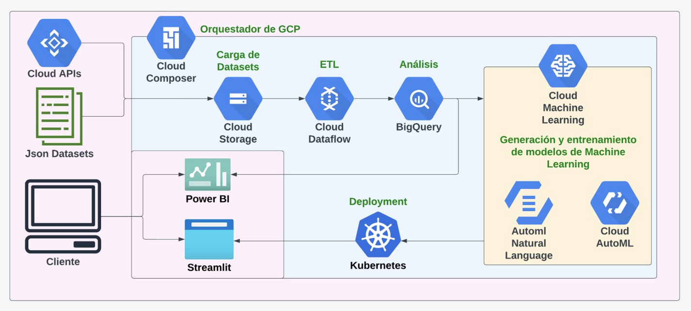

# **Henry Final Project - Group Nº1**

# <h1 align="center">**`EXPERIENCE FINDER`**</h1>

 

# Google Maps

### Descripción

Este proyecto implica realizar un análisis de mercado en los Estados Unidos para un cliente que es parte de un conglomerado de restaurantes y negocios relacionados. El objetivo es analizar las opiniones de los usuarios en Google Maps con respecto a hoteles, restaurantes y otros negocios relacionados con el turismo. El proyecto implica la recopilación, limpieza y disponibilidad de los datos, la realización de un análisis importante utilizando técnicas de aprendizaje automático y la formulación de recomendaciones en base a los hallazgos. Los datos se extraerán de la plataforma de revisión de Google Maps en los EE. UU. y pueden incluir información sobre la ubicación, la categoría, las puntuaciones promedio y las revisiones realizadas por los usuarios. Se pueden utilizar fuentes de datos adicionales para complementar el análisis, como las cotizaciones de acciones y las tendencias en las redes sociales y los medios. El proyecto también puede involucrar la mejora de estrategias de marketing y la creación de sistemas de recomendación para ubicaciones específicas, como restaurantes y hoteles.

## **Situación actual**

EF es una empresa ficticia que fue contratada por un conglomerado de hoteles y afines para realizar un análisis de mercado en los Estados Unidos en rubros cercanos al turismo. 
Para realizar este analisis, se van a utilizar las opiniones de los usuarios en Google Maps con respecto a hoteles, restaurantes y otros negocios relacionados. El proyecto implica la recopilación, limpieza y disponibilidad de los datos, la realización de un análisis utilizando técnicas de aprendizaje automático y la formulación de recomendaciones en base a los hallazgos. 

## **Objetivos**
[Business Plan]
Dar un plan de negocio a la empresa que nos contrata. En este caso la empresa es 'Whyndham'. Este Plan incluye demostrar los nuevos rubros en los cuales podría incursionar para crecer como marca y por otro lado, nuevos lugares en donde se recomienda realizar la expansión de la empresa en Estados Unidos.

[APP]
Brindar un sistema de recomendación de restaurantes y servicios <usando servicio GMaps> para los usuarios de Whyndham y así darle la posibilidad de mejorar la experiencia completa de la estadía.
Esto fortaleceria el branding de la empresa.  

Instrucciones originales del proyecto [aquí](https://github.com/soyHenry/PF_DS/blob/main/Proyectos/google-maps.md) 

## **Equipo**

|Nombre          | Correo                     | Linkedin|
|----------------|----------------------------|---------|
|Blas De Olano|blas.deolano@gmail.com    |[fdbo](https://www.linkedin.com/in/fbdo/)|
|Alejandro del Gerbo  |adelgerbo@gmail.com   |[alejandro-del-gerbo](https://www.linkedin.com/in/alejandro-del-gerbo-actis-30523225/)|
|Nahuel Vargas  |naguieta@gmail.com|[nahuelvargas](https://www.linkedin.com/in/nahuelvargas/)|
|Cristian Garcia   |cristiangarcia0716@gmail.com   ||
|Yamila Galiano   |yami_cba7@hotmail.com     |[yamila-galiano](https://www.linkedin.com/in/yamila-galiano-ba7083121/)|  

# **Datos**
Los datos se obtuvieron de un dataset provisto por Henry. Puede acceder a ellos desde el siguiente [link](https://drive.google.com/drive/folders/1Wf7YkxA0aHI3GpoHc9Nh8_scf5BbD4DA). Estos datos fueron unificados y analizados mediantes un [EDA]() y un [ETL](). 
 
Datasets externos:
- [Places API](https://developers.google.com/maps/documentation/places/web-service?hl=es-419)
- [Cities](https://www.kaggle.com/datasets/louise2001/us-cities?resource=download)
 

Fuentes extras para sumar al analisis:
- [Worlddata](https://www.worlddata.info/america/usa/tourism.php)
- [bloomberg](https://www.bloomberg.com/news/articles/2022-10-14/tourism-not-business-travel-fuels-higher-revenue-for-cities)
- [cnbc](https://www.cnbc.com/2022/11/09/fastest-growing-us-cities-kenan-institute.html)
- [skift](https://skift.com/2022/12/21/the-remaking-of-tourism-in-5-u-s-cities/)

## **Esquema**

- - -
## **Stack tecnológico elegido**
Tras analizar las opciones disponibles online para nuestra infraestructura, decidimos utilizar los servicios de Google Cloud Platform.

- - -
Link de nuestro dashboard [aquí](https://drive.google.com/drive/u/1/folders/1LtEy0DHGqd9iHBS1JobLgSw0_-RyfSMd). 

Link a nuestra app de recomendaciones [aquí](). 

## **Video**
Video del proyecto [aquí]()

## **Informe final entregado a la empresa**
Informe final [aquí]()

## **Documentation**
Documentación del proyecto [aquí]()
